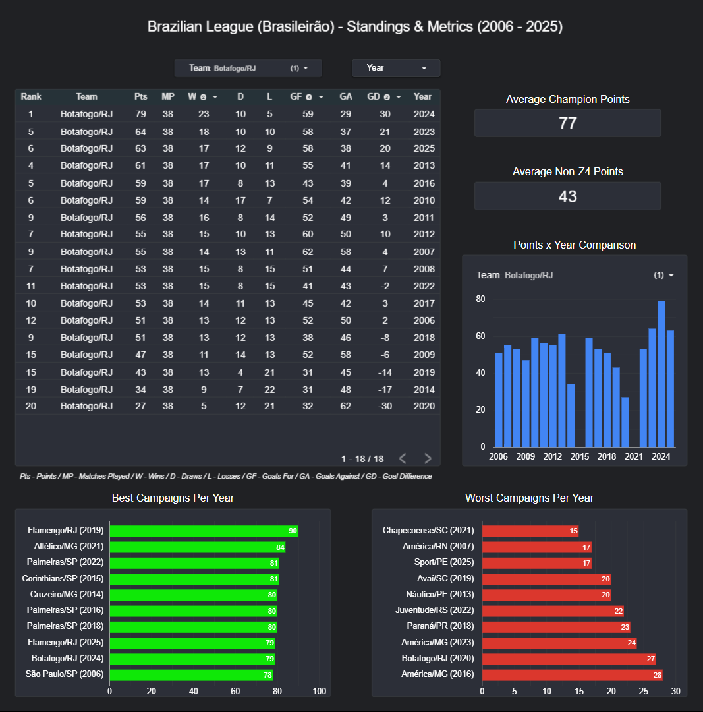

# Brasileirão – Standings and Metrics

## 📌 Project Description

In this project, I use the **`matches-2003-2025.txt`** file, sourced from a public dataset available on **[Kaggle](https://www.kaggle.com/datasets/rczekster/matches-brazilian-football-from-2003-to-2019)**, with the goal of performing an **ETL (Extract, Transform, Load)** process applied to Brazilian Championship data.

From this file, I extract and transform information related to all matches from the **first division of the Brazilian league under the round-robin format**, covering the period from **2003 to the most recent season, 2025**.

---

## 🎯 Objective

The main objective of this project was to **develop a custom logic to transform raw match data into meaningful parameters**, capable of manually reconstructing the league standings, allowing the complete table of a specific season to be obtained by filtering by year.

To achieve this, the project considers:
- The **current standardized format of the Brazilian league**, with **20 teams**, adopted between **2006 and 2025**;
- Official league scoring rules;
- Season-level aggregation of match results.

In addition to the standings, the project also explores relevant historical metrics, such as:
- Team performance history across seasons, in both tabular and graphical formats;
- Average number of points required to win the league;
- Minimum points historically required to avoid relegation;
- Top 10 highest and lowest point totals recorded in a single season.

These metrics help contextualize team performance throughout different editions of the championship.

---

## 📈 Results Visualization

The final results of the data processing and analysis can be explored visually through an **interactive dashboard**, developed using **Google Looker Studio**, based on the final output of the code:

🔗 **[Dashboard – Brasileirão: Standings and Metrics](https://lookerstudio.google.com/reporting/519f6b7f-e74e-4ca9-8fbc-6105918f0644)**

